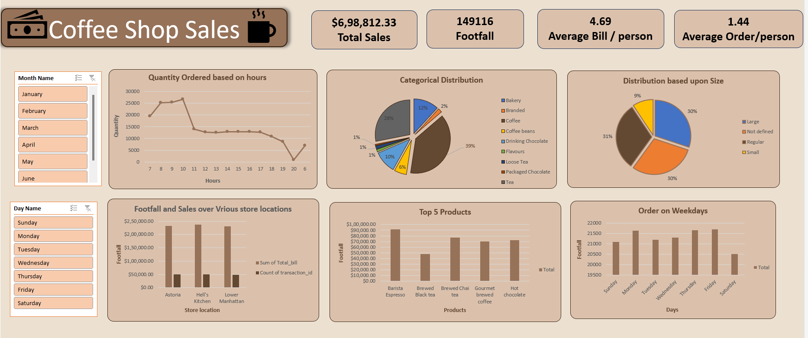

# Coffee Shop Sales Dashboard

This repository contains a **Coffee Shop Sales Dashboard** created using Microsoft Excel. The dashboard provides insights into sales, footfall, product performance, and distribution patterns for a coffee shop chain. 

---

## Features

The dashboard includes the following key visualizations and metrics:

1. **Total Sales and Footfall**
   - Displays total revenue, total footfall, and average order/bill per person.
   
2. **Quantity Ordered Based on Hours**
   - Line graph showing sales distribution across hours to identify peak business times.
   
3. **Categorical Distribution**
   - Pie chart showcasing sales contribution across different product categories (e.g., Coffee, Tea, Bakery, etc.).

4. **Distribution Based on Size**
   - Pie chart highlighting the sales share by product size (e.g., Large, Regular, Small).

5. **Footfall and Sales by Store Locations**
   - Bar chart comparing sales and footfall across multiple store locations.

6. **Top 5 Products**
   - Horizontal bar graph listing the best-selling products based on revenue.

7. **Order on Weekdays**
   - Bar chart depicting the total orders across different days of the week to identify trends.

---

## Objectives

- To analyze sales data and provide actionable insights.
- To understand customer behavior across different time frames, product categories, and store locations.
- To assist in data-driven decision-making for inventory and marketing strategies.

---

## Tools Used

- **Microsoft Excel**: For data visualization, analysis, and creating the dashboard.
- **Pivot Tables & Charts**: To organize and summarize data effectively.
- **Conditional Formatting**: To enhance data readability.

---

## How to Use

1. **Open the File**: Download and open the Excel file.
2. **Explore Filters**: 
   - Use the **Month Name** and **Day Name** slicers to filter data dynamically.
3. **Interact with the Visualizations**:
   - Analyze trends, peak hours, and product performance for informed decision-making.

---

## Insights

- **Sales Distribution**: Coffee contributes the most significant portion of sales (39%), followed by Bakery items.
- **Peak Hours**: Sales peak between 8 AM to 11 AM, indicating high morning activity.
- **Weekday Trends**: Friday has the highest order volume, suggesting promotional opportunities.
- **Top Performing Store**: Lower Manhattan leads in both sales and footfall.

---

## Contribution

Feel free to contribute by:
- Suggesting improvements for the dashboard.
- Adding more interactive features to enhance data analysis.

---

## Contact

For any questions or feedback, feel free to reach out .

---

